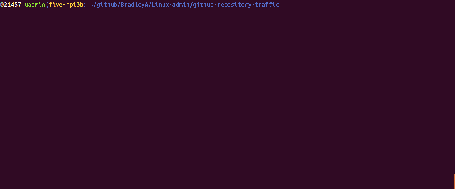

# github-repository-traffic 

This subdirectory contains shell scripts that download traffic information before it is lost on GitHub.  Most scripts in this repository support --help and --usage options.

### in design & development  (7/2019)

 

 
 
**WARNING**: These instructions are incomplete. Consider them as notes quickly drafted on a napkin rather than proper documentation!
 
### Clone

To install, follow these steps.  Use git to pull or clone these scripts into the directory. If you do not have git then enter; "sudo apt-get install git". On the GitHub page of this script use the "HTTPS clone URL" with the 'git clone' command.

    cd /tmp
    git clone https://github.com/BradleyA/Linux-admin
    cd Linux-admin/github-repository
    
1) Change **BradleyA** below to your GitHub repository owner name or who you signed in as on GitHub
2) Change the lines in github.repository.list file to your GitHub repository names

       ./setup.github.repository.sh BradleyA
       cd ../..
       rm -rf Linux-admin/
       cd /usr/local/data/github/

## Output

Enter crontab -e to add the lines from setup.github.repository.sh to crontab 

    crontab -e
   
Edit ~/.netrc or what ever solution you use for authentication  (No you don't push any file like this to anywhere. Duh!)     
    
    vi ~/.netrc
    chmod 600 ~/.netrc
    
    
    machine api.github.com login <github-owner-account-name> password <secret-github-password>

### FILE Definition and ARCHITECTURE TREE

To set github login to support automation of script running on system 'two' in crontab by editing file, ~/.netrc

    machine api.github.com login BradleyA password secret-not-known-to-you

For each repository that requires their data to be pulled will need a file that is formatted like repository:owner-repository and rm -rf Linux-admin/contains the git commands.

    #!/bin/bash
    ###	BradleyA.Search-docker-registry-v2-script.1.0
    . . . 

#### Traffic

 *   [Clones Table](images/clone.table.md)
 *   [Views Table](images/view.table.md)

#### Author
       

#### System OS script tested
 * Ubuntu 14.04.3 LTS
 * Ubuntu 16.04.3 LTS (armv7l)

#### Design Principles
 * Have a simple setup process and a minimal learning curve
 * Be usable as non-root - failed adminstration requires root
 * Be easy to install and configure

###### TESTing
##### quick note:
    cd uadmin@two: /usr/local/data/github/BradleyA/Search-docker-registry-v2-script.1.0
    rm clone.table.md view.table.md   # this is not required, only process the latest files by cron or docker in future
     ../../parse.repository.data.sh BradleyA.Search-docker-registry-v2-script.1.0.2019-07-29
    ../../parse.repository.data.sh BradleyA.Search-docker-registry-v2-script.1.0.2019-08-05
    . . .
    cat clone.table.md
    cat view.table.md

#### Git clones
Date:    |        07-29   |       08-05   |       08-12   |       08-19  |  08-26  |  09-02  |  09-09
|:---    |:---:   |:---:  |:---:  |:---:  |:---:  |:---:  |:---:
Clones:  |        34      |       31      |       2       |       2      |  4      |  2      |  2
Unique   clones:  |       2       |       3       |       2       |      2  |      2  |      2  |      2

Total clones: 77
###### Updated: 2019-12-23

#### Visitors
Date:   |         07-22   |       07-29   |       08-05   |       08-12   |       08-19   |  08-26  |  09-23  |  09-30  |  10-07  |  10-14
|:---   |:---:    |:---:  |:---:  |:---:  |:---:  |:---:  |:---:  |:---:  |:---:  |:---:
Views:  |         2       |       139     |       273     |       2       |       2       |  14     |  6      |  2      |  1      |  5
Unique  vistors:  |       2       |       2       |       3       |       1       |       1  |      2  |      2  |      2  |      1  |      1

Total views: 446
###### Updated: 2019-12-23

## License
MIT License

Copyright (c) 2019  [Bradley Allen](https://www.linkedin.com/in/bradleyhallen)

Permission is hereby granted, free of charge, to any person obtaining a copy of this software and associated documentation files (the "Software"), to deal in the Software without restriction, including without limitation the rights to use, copy, modify, merge, publish, distribute, sublicense, and/or sell copies of the Software, and to permit persons to whom the Software is furnished to do so, subject to the following conditions:

The above copyright notice and this permission notice shall be included in all copies or substantial portions of the Software.

THE SOFTWARE IS PROVIDED "AS IS", WITHOUT WARRANTY OF ANY KIND, EXPRESS OR IMPLIED, INCLUDING BUT NOT LIMITED TO THE WARRANTIES OF MERCHANTABILITY, FITNESS FOR A PARTICULAR PURPOSE AND NONINFRINGEMENT. IN NO EVENT SHALL THE AUTHORS OR COPYRIGHT HOLDERS BE LIABLE FOR ANY CLAIM, DAMAGES OR OTHER LIABILITY, WHETHER IN AN ACTION OF CONTRACT, TORT OR OTHERWISE, ARISING FROM, OUT OF OR IN CONNECTION WITH THE SOFTWARE OR THE USE OR OTHER DEALINGS IN THE SOFTWARE.
