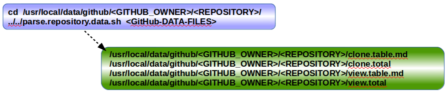

# github-repository-traffic

## Goal

Present GitHub repositories traffic history more than 14 days

## Description

A very simple bash shell script that uses crontab to schedule the download of GitHub traffic statistics in plain text from your GitHub repositories.  Another script gives you the text lines to add to crontab and sets up directories for GitHub traffic statistics.   It takes minutes to setup but weeks to get enough GitHub traffic statistics to analyze.

At this point you can process the GitHub traffic statistics on your system with any tools you wish.  I chose not to go the route of leveraging tools to plot statistics or allowing third party platforms to access my GitHub account.  I also chose that additional investment of time was not worth the return of that investment at this time.  So I created a third script that parses the GitHub traffic and creates two markdown tables (clone, views).  Clone table example:

#### 2019 GitHub clones
Date:		    |        07-29   |       08-05   |       08-12   |       08-19   |       08-26   |       09-02  |  09-09  |  12-09  |  12-16  |  12-23  |  12-30
|:---    |:---:   |:---:  |:---:  |:---:  |:---:  |:---:  |:---:  |:---:  |:---:  |:---:  |:---:
Clones:		  |        34      |       31      |       2       |       2       |       4       |       2      |  2      |  1      |  2      |  9      |  4
Unique   clones:  |       2       |       3       |       2       |       2       |       2       |      2  |      2  |      1  |      2  |      8  |      2

Total clones: 93
###### Updated: 2020-01-04

#### If you like this repository, select in the upper-right corner,  STAR,  thank you.

## Install, Setup, and Configure GitHub Repository Traffic

To download your GitHub repositories traffic history, follow these steps.  Use git to pull or clone these scripts into a directory. If you do not have git then enter; "sudo apt-get install git" if using Ubuntu. On the GitHub page of this script use the "HTTPS clone URL" with the 'git clone' command.

1) Change to the /tmp directory and download/clone the files to your system ([see Download Files](https://github.com/BradleyA/Linux-admin/blob/master/github-repository-traffic/README.md#download-files)).

       cd  /tmp
       git clone https://github.com/BradleyA/Linux-admin

2) Change the lines in github.repository.list file to your GitHub repository names that you want GitHub historic traffic information.

       cd  /tmp/Linux-admin/github-repository-traffic
       vi ./github.repository.list

3) Run the following to setup github-repository-traffic.  Change \<GITHUB_OWNER> to your \<GITHUB_OWNER>, which is the login name you use for GitHub.  This script creates directories and copies github-repository-traffic files into those directories ([see ARCHITECTURE TREE](https://github.com/BradleyA/Linux-admin/blob/master/github-repository-traffic/README.md#architecture-tree)).  It reads github.repository.list file for your list of repositories that you want historic traffic information.  It creates a symbolic link from \<GITHUB_OWNER>.\<REPOSITORY> to the script ../owner.repository and prints the lines to add to crontab.  You need to have permission to create /usr/local/data/github for short and long term storage.  To use a different directory that you have write permission; Example, export GITHUB_TRAFFIC_DIR=/home/\<USER>/github.
       
       ./setup.github.repository.sh <GITHUB_OWNER>

#### Step 3 output

4) Remove the download/clone files from the /tmp directory.
    
       cd  ../..
       rm  -rf  ./Linux-admin/
 
5) Enter crontab -e to append the setup.github.repository.sh output lines into your crontab file.  Each line includes a time and date for the script to run, the script, and a log file.  The file name is a symbloic link from \<GITHUB_OWNER>.\<REPOSITORY> to the script ../owner.repository.  The symbolic links where created when running setup.github.repository.sh.  The script 'owner.repository' uses it's linked file name to know which GitHub account and repository to pull the traffic information from.  This would be a good time to change the time you want cron to run these scripts.  I have cron run my script weekly on Monday at 12:20 P.M.

       crontab -e
   
6) Set GitHub login to support automation of scripts run by cron, edit ~/.netrc and add a personal access token for authentication from GitHub. [Creating a personal access token for the command line.](https://help.github.com/en/github/authenticating-to-github/creating-a-personal-access-token-for-the-command-line)   No you don't push any file like ~/.netrc to anywhere, ever. Duh!
    
       vi ~/.netrc
    
           machine api.github.com login BradleyA password <secret-github-token>
       
       chmod 600 ~/.netrc
 

## Parse GitHub Historic Traffic File

Parse output from owner.repository script to create [clone,view].table.md, [clone,view].total, and [clone,view].\<DATE> files in the repository data directory.  These steps work after a week or so of running the script above because you need data to parse. 
  
1) Change to the repository data directory and list the files.

       cd  /usr/local/data/github/<GITHUB_OWNER>/<REPOSITORY>
       ls
       
2) Parse output from owner.repository script to create [[clone](../images/clone.table.md), [view](../images/view.table.md)].table.md, [clone,view].total, and [clone,view].<DATE> files.

       ../../parse.repository.data.sh  <GITHUB_OWNER>.<REPOSITORY>.<DATE>

#### Steps 1 & 2 output

3) Copy the parsed data files to your GitHub repository or where you plan to use it.

Note: add this later:

    cd /usr/local/data/github/BradleyA/Start-registry-v2-script.1.0
    for TRAFFIC in $(ls -1 BradleyA.Start-registry-v2-script.1.0.2020-*) ; do echo $TRAFFIC ; ../../parse.repository.data.sh $TRAFFIC ; done

## Download Files:

**644 clone.heading** - Clone table headings in GitHub markdown

**664 github.repository.list** - Your GitHub repository names that you want historic traffic information with one on each line.  Lines that include with a '#' anywhere are comment lines.

**775 owner.repository** - Script that downloads the GitHub repository historic traffic information.  The owner.repository script is linked to \<GITHUB_OWNER>.\<REPOSITORY> because the script uses the file name for \<GITHUB_OWNER> and \<REPOSITORY>.  The output data file is /usr/local/data/github/\<GITHUB_OWNER>/\<REPOSITORY>/\<GITHUB_OWNER>.\<REPOSITORY>.\<DATE> or ${GITHUB_TRAFFIC_DIR}/github/\<GITHUB_OWNER>/\<REPOSITORY>/\<GITHUB_OWNER>.\<REPOSITORY>.\<DATE>.  It is scheduled to run once a week using crontab but can be scheduled more or less often.

You could copy owner.repository script to \<GITHUB_OWNER>.\<REPOSITORY> file name and not use links.  But this method will add additional rework, or technical debt, when changes are need to owner.repository script. 

**775 parse.repository.data.sh** - Parse output from owner.repository script to create [[clone](../images/clone.table.md), [view](../images/view.table.md)].table.md, [clone,view].total, and [clone,view].\<DATE> files.  [[clone](../images/clone.table.md), [view](../images/view.table.md)].table.md is a markdown table organized in two rows; [Clones,Views] and [Unique clones,Unique vistors], with dated columns.  [clone,view].total file includes the total only.  [clone,view].\<DATE> contains one column of markdown formated table data to be used in [clone,view].table.md file.  

Use the data in these files how ever you planned.  I have used them in my \<GITHUB_OWNER>/\<REPOSITORY>/README.md file and copied some files to \<GITHUB_OWNER>/\<REPOSITORY>/images directory.

In the future I want to automate a push of this data to GitHub repositories but that has many challenges (which branch, how much of a repository needs to be cloned to make a git push with new files, is someone editing README.md, etc).

**775 setup.github.repository.sh** - This script works for the local host only.  This script creates directories and copies github-repository-traffic files into those directories.  It reads github.repository.list file for your list of repositories that you want GitHub traffic.  It creates a symbolic link from \<GITHUB_OWNER>.\<REPOSITORY> to the script ../owner.repository and prints the lines to add to crontab.  

GitHub owner and github.repository.list are required for this script to work.  <GITHUB_OWNER> can be the first argument on the command line or defined as GITHUB_OWNER environment variable.

Data storage is required for this solution, so you need to have permission to create /usr/local/data/github for short and long term storage.  To use a different directory export GITHUB_TRAFFIC_DIR environment variable.

In the future, this printed crontab list will be appended to a crontab file.  The crontab command normally only manages a single crontab per user.  Need a method for multiple SRE team members to manage one crontab.

**644 view.heading** - View table headings in GitHub markdown

## ARCHITECTURE TREE
    /usr/local/data/                           <-- <DATA_DIR>
    └── github                                 <-- GitHub long term traffic solution
        ├── clone.heading                      <-- Clone table headings
        ├── github.repository.list             <-- GitHub repository names
        ├── owner.repository                   <-- Default cron job for repository
        │                                          download of GitHub traffic data
        ├── parse.repository.data.sh           <-- Parse relevant data out of cron
        │                                          job data file
        ├── setup.github.repository.sh         <-- Setup GitHub long term traffic
        │                                          solution
        ├── view.heading                       <-- View table headings
        ├── <GITHUB_OWNER>                     <-- Links to ../owner.repository
        │   ├── <REPOSITORY-1>                 <-- Current year of GitHub repository
        │   │   │                                  traffic data
        │   │   └── <YEAR>                     <-- Previous years of GitHub
        │   │                                      repository traffic data
        │   └── <REPOSITORY-2>                 <-- Current year of GitHub repository
        │                                          traffic data
        └── <GITHUB_OWNER>                     <-- Links to ../owner.repository
  
#### Rquirements:
    * Linux
    * git
    * Internet access to GitHub
    * Permission to run crontab jobs on your system (other commands you could use; at, or batch)
    * Write permission in /usr/local/data directory, if not, use a directory you do have write permission, 'export GITHUB_TRAFFIC_DIR=~/github'
    
#### Traffic
 *   [Clones Table](../images/clone.table.md)
 *   [Views Table](../images/view.table.md)

#### Author
       

#### System OS script tested
 * Ubuntu 14.04.3 LTS (amd64,armv7l)
 * Ubuntu 16.04.3 LTS (armv7l)

#### Design Principles
 * Have a simple setup process and a minimal learning curve
 * Be usable as non-root
 * Be easy to install and configure

#### License
MIT License

Copyright (c) 2020  [Bradley Allen](https://www.linkedin.com/in/bradleyhallen)

Permission is hereby granted, free of charge, to any person obtaining a copy of this software and associated documentation files (the "Software"), to deal in the Software without restriction, including without limitation the rights to use, copy, modify, merge, publish, distribute, sublicense, and/or sell copies of the Software, and to permit persons to whom the Software is furnished to do so, subject to the following conditions:

The above copyright notice and this permission notice shall be included in all copies or substantial portions of the Software.

THE SOFTWARE IS PROVIDED "AS IS", WITHOUT WARRANTY OF ANY KIND, EXPRESS OR IMPLIED, INCLUDING BUT NOT LIMITED TO THE WARRANTIES OF MERCHANTABILITY, FITNESS FOR A PARTICULAR PURPOSE AND NONINFRINGEMENT. IN NO EVENT SHALL THE AUTHORS OR COPYRIGHT HOLDERS BE LIABLE FOR ANY CLAIM, DAMAGES OR OTHER LIABILITY, WHETHER IN AN ACTION OF CONTRACT, TORT OR OTHERWISE, ARISING FROM, OUT OF OR IN CONNECTION WITH THE SOFTWARE OR THE USE OR OTHER DEALINGS IN THE SOFTWARE.
