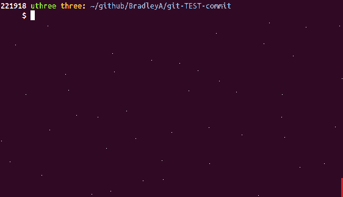

## View test case depth for a file

Objective 3)  **Quick check of test case depth for a file (option -f) and all files for any Git repository (option -a)**

After completing: **Install git-TEST-commit-automation solution** enter the following command to view test case depth for sample.sh.
   
**Use --filename sample.sh to see what type of test cases are for sample.sh**
    
    git-TEST-cases.sh --filename sample.sh
    INFO:  If file not found, check spelling or including --hooks option.
    ./sample.sh
    ./TEST/sample.sh
    ./TEST/sample.sh/SA-shellcheck-001.test-case-output
    ./TEST/sample.sh/SA-shellcheck-001
    ./TEST/sample.sh/SA-permission-775-001
    ./TEST/sample.sh/SA-cleanup.sh
    ./TEST/sample.sh/SA-setup.sh
    ./TEST/sample.sh/SA-shellcheck-001.expected

Two Static Analysis (SA) test cases were found for sample.sh.

Objective 3) **Done, depth check in seconds**

**That is it!**

#### [Back to README](https://github.com/BradleyA/git-TEST-commit-automation/tree/master/hooks#view-test-case-depth-for-a-file)
