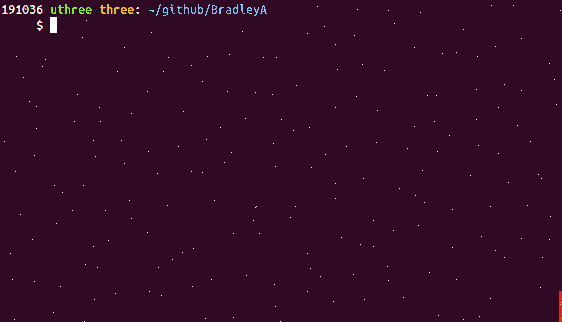
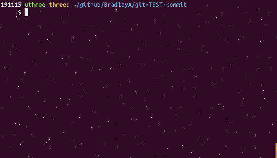
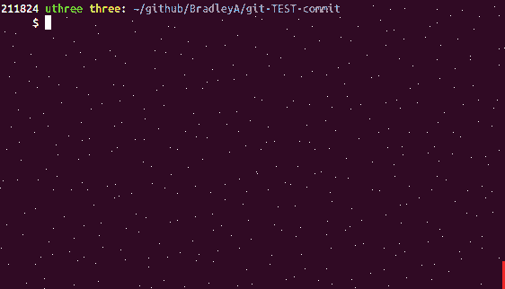
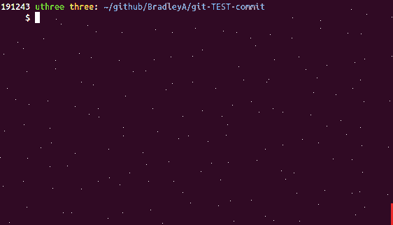

## Install/evaluate git-TEST-commit-automation solution
Steps to evaluate git-TEST-commit-automation solution

**Start a new Git repository to test git-TEST-commit-automation solution**

    mkdir -p git-TEST-commit    #  Create a directory for a Git repository
    cd git-TEST-commit
    git init .                  #  Create an empty Git repository
    vi sample.sh                #  Write a shell script
    
         #!/bin/bash
         ###  sample.sh 
         echo "Hello World"
    
    chmod 775 sample.sh
    git add sample.sh
    git commit -m 'initial commit' sample.sh

    
Objective 1) **Quick setup with default test cases for any Git repository (in seconds)**

**Download and execute setup-git-TEST-cases.sh to setup git-TEST-commit-automation solution**
This will download git-TEST-commit-automation files into a Git repository top directoy named **hooks**.  It will create two symbolic links for .git/hooks/pre-commit and .git/hooks/post-commit to hooks/pre-commit and hooks/post-commit.  It will also copy three files, git-TEST-cases.sh, setup-git-TEST-cases.sh and uninstall-git-TEST-cases.sh to /usr/local/bin.

    curl -L https://api.github.com/repos/BradleyA/git-TEST-commit-automation/tarball | tar -xzf - --wildcards BradleyA-git-TEST-commit-automation-*/hooks/bin/setup-git-TEST-cases.sh ; mv BradleyA-git-TEST-commit-automation-*/hooks/bin/setup-git-TEST-cases.sh . ; rm -r BradleyA-git-TEST-commit-automation-*/
    ./setup-git-TEST-cases.sh   #  setup git-TEST-commit-automation in hooks directory and .git/hooks directory
    rm setup-git-TEST-cases.sh  #  remove setup-git-TEST-cases.sh and setup is complete
    

Objective 1)  **Done, installed in seconds**

Objective 4)  **Quick setup of default SA- test cases for a file (git-TEST-cases.sh --filename sample.sh --add)**
    
**Configure two default test cases for sample.sh**   
    
    git-TEST-cases.sh --filename sample.sh --add
    git add TEST/sample.sh
    git commit -m 'initial commit'

Objective 4)  **Done, in seconds**

**Make a change to sample.sh and run 'git add' and 'git commit'**
    
    vi sample.sh
    
         echo "First change"    #  add this line to end of sample.sh file
	 
    git add sample.sh
    git commit -m 'First change'

Two Static Analysis (SA) test cases were executed on sample.sh with both PASSing.  When you make changes to sample.sh and run Git commit, hook post-commit will search for test cases to run in TEST/sample.sh/ directory.

**That is it!**

**NOTE:**  To use a different SA- test case other than the default test cases, remove the symbilic link (rm TEST/sample.sh/SA-setup.sh) and copy SA-setup.sh into the directory (cp -p hooks/EXAMPLES/SA-setup.sh TEST/sample.sh/).  Edit SA-setup.sh with custom test cases needed for a Git commit file.  Place the custom test cases in the same directory as the edited SA-setup.sh.  Once finished use git add and git commit to have the test case changes tracked (TEST/sample.sh/SA-setup.sh).  

#### [Back to README](https://github.com/BradleyA/git-TEST-commit-automation/tree/master/hooks#installevaluate-git-test-commit-automation-solution)
