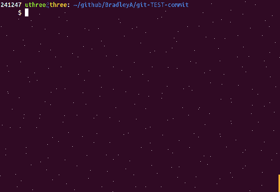

## Setup default SA- test cases for a new file

Objective 4) **Quick setup of default SA- test cases for a file (--filename sample.sh --add)**
   
**Use '--filename test.sh --add' to add default SA- test cases for test.sh**
    
    cp sample.sh test.sh
    git add test.sh
    git-TEST-cases.sh --filename test.sh --add
    git-TEST-cases.sh -a
    

Two Static Analysis (SA) test cases were added to test.sh.  Entering git-TEST-cases.sh -a (--all) prints all the test case files.

Objective 4) **Done, in seconds**

**That is it!**

Don't forget to commit these changes to your Git repository.

    git commit -m 'initial commit'
    git status
    ls -l

#### [Back to README](https://github.com/BradleyA/git-TEST-commit-automation/tree/master/hooks#setup-default-sa--test-cases-for-a-new-file)
